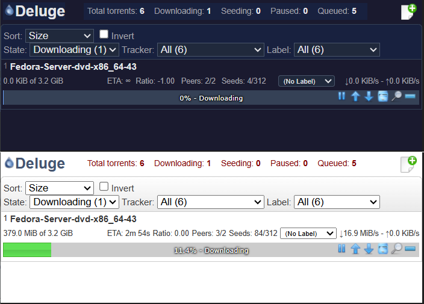
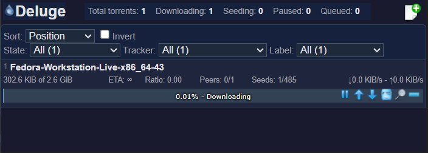
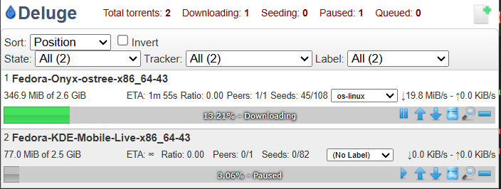

# Deluge Remote Modern

A lightweight, open-source Chrome extension to manage your [Deluge](https://deluge-torrent.org/) BitTorrent client directly from your browser. A complete modern fork of the original [Remote Deluge](https://github.com/YodaDaCoda/chrome-deluge-remote), fully rebuilt for Manifest V3 with themes, icon packs, password encryption, and vanilla JS.

---

## Features

- **Real-Time Monitoring** — View torrent status, speeds, ETA, ratio, peers and seeds at a glance
- **Full Control** — Pause, resume, recheck, re-order, label, and delete torrents without leaving your tab
- **One-Click Adding** — Send magnet links and `.torrent` URLs to Deluge via context menu or automatic link detection
- **Password Encryption** — Your Deluge password is encrypted with AES-256-GCM before being stored in sync storage
- **Multi-Theme Support** — System auto, Light, Dark (Midnight), Solarized Dark, Nord, and Dracula
- **Icon Packs** — Choose between Classic (original PNGs) or Modern (SVG glyphs that adapt to your theme)
- **Label Selector** — Change torrent labels directly from the popup (requires Deluge Label plugin)
- **Variable Refresh Rate** — Configure how often the popup polls your server (500ms – 30s)
- **Minimal Permissions** — Only `contextMenus`, `storage`, and host access. No `tabs`, no tracking.

---

## What's Different from the Original

This fork modernizes [chrome-deluge-remote](https://github.com/YodaDaCoda/chrome-deluge-remote) which hasn't been updated since 2017:

| Feature | Original | This Fork |
| --- | --- | --- |
| Manifest Version | V2 | **V3** |
| Background | Persistent page | **Service Worker** |
| Network calls | jQuery AJAX | **Native fetch()** |
| JS framework | jQuery (78KB) | **Vanilla JS (0KB)** |
| Password storage | Plain text | **AES-256-GCM encrypted** |
| Themes | None | **6 themes + system auto** |
| Icon style | PNG only | **Classic PNG + Modern SVG** |
| Label editing | None | **Inline label selector** |
| Default protocol | HTTP | **HTTPS** |

---

## Installation

### From the Chrome Web Store *(recommended)*

Search for **Deluge Remote Modern** or install directly from the listing.

### Load Unpacked (Developer Mode)

1. Download the latest ZIP from [Releases](https://github.com/TSA3000/deluge-remote-modern/releases)
2. Unzip it
3. Open Chrome → `chrome://extensions`
4. Enable **Developer mode** (top right)
5. Click **Load unpacked** and select the unzipped folder

---

## Configuration

Click the extension icon → open **Options**:

- **Address** — Protocol, IP/hostname, port, and optional base path for reverse proxies
- **Password** — Your Deluge Web UI password (encrypted with AES-256-GCM before storage)
- **Link Handling** — Enable/disable automatic interception of `.torrent` and `magnet:` links
- **Context Menu** — Right-click any link to send it directly to Deluge
- **Theme** — System auto, Light, Dark (Midnight), Solarized Dark, Nord, Dracula
- **Icon Pack** — Classic (original PNGs) or Modern (SVG glyphs, theme-aware colors)
- **Refresh Interval** — How often the popup polls for updates (500ms – 30s)
- **Badge Timeout** — How long the Add/Fail badge shows after adding a torrent

---

## Themes

Choose from six themes in **Options → Appearance → Theme**:

| Theme | Description |
| --- | --- |
| System (auto) | Follows your OS light/dark preference |
| Light | Original light style |
| Dark (Midnight) | Deep navy blue dark theme |
| Solarized Dark | Ethan Schoonover's classic Solarized palette |
| Nord | Arctic, north-bluish cool tones |
| Dracula | Purple and pink dark theme |

All themes use CSS custom properties — the base selectors live in `css/theme-base.css` and each theme defines only its variables in `css/themes/`.

**Adding a custom theme** requires only:

1. Create `css/themes/mytheme.css` with variables under `[data-theme="mytheme"]`
2. Add a `<link>` tag in `popup.html` and `options.html`
3. Add an `<option>` to the theme dropdown in `options.html`

---

## Icon Packs

Choose between two icon styles in **Options → Appearance → Icon Pack**. A live preview strip shows all buttons updating in real time as you switch.

### Classic *(default)*

The original 16×16 PNG icons. Zero visual change for existing users.

### Modern

SVG glyphs rendered via CSS `mask-image`. Each icon uses semantic colors that adapt to the active theme:

| Action | Color |
| --- | --- |
| Pause | Amber / Yellow |
| Resume | Green |
| Auto-managed | Blue |
| Delete | Red |
| Move Up / Down | Theme text |
| Recheck | Theme text |

---

## Screenshots

### Dark & Light Side by Side

### Dark Mode

### Light Mode

### Original Style

---

## Version History

### 2026-04-09 v2.3.1 — Service Worker & Default Sync Fix

- Fixed login broken after v2.3.0 — re-added `start(false)` with `allowOpenOptions` parameter so service worker loads config on wake-up
- Synced refresh interval default to 3s in background.js (was 1s, mismatched with frontend)

### 2026-04-09 v2.3.0 — First Install & Options Save Fixes

- Fixed OK button closing before settings saved (async race condition)
- Fixed form fields using placeholder instead of value (empty on first save)
- Fixed default refresh interval showing 1s instead of 3s in dropdown
- Fixed double options tab on first install
- Fixed auto-save overwriting settings with empty defaults on first install
- Added error handling to chrome.runtime.sendMessage()

### 2026-04-09 v2.2.2 — Project Cleanup & Image Reorganization

- Reorganized images into `images/classic/` and `images/modern/` icon pack folders
- Fixed 6 broken CSS image paths pointing to deleted `/themes/standard/images/`
- Removed dead CSS selectors and unused files (darkmode.css, Deluge.Formatters.js, stray copies)
- Deleted 5 unused image files

### 2026-04-05 v2.2.1 — Torrent Stats Polish

- Ratio, ETA, Peers, Seeds and Speed now show `—` instead of zero values for inactive torrents (Queued, Paused, Checking, Error)
- ETA no longer shows `∞` on queued torrents
- Speed row hidden when torrent is not actively transferring

### 2026-04-05 v2.2.0 — Icon Pack System

- Selectable icon packs in Options → Appearance (Classic and Modern)
- Modern pack: SVG glyphs with theme-aware semantic colors, live preview in Options
- CSS mask-image approach — icons adapt to all 6 themes automatically

### 2026-04-05 v2.1.0 — Theme Engine

- Replaced `darkmode.css` with a CSS custom-property theme engine
- Added Solarized Dark, Nord, and Dracula themes alongside the existing Dark theme
- Fully extensible — new themes need only one CSS file

### 2026-04-03 v2.0.9 — Permissions & Performance

- Removed unnecessary `tabs` permission
- Default refresh interval changed from 1s to 3s

### 2026-04-03 v2.0.8 — Variable Refresh Rate

- Added configurable refresh interval (500ms – 30s) in Options

### 2026-04-03 v2.0.7 — Server Crash Prevention

- Fixed critical crash when deleting a torrent during a concurrent refresh
- Blocked deletion of torrents in Moving or Allocating state
- Improved `.torrent` link detection to handle query params and uppercase extensions

### 2026-04-03 v2.0.6 — Version Bump

- Manifest version updated for Chrome Web Store resubmission

### 2026-04-03 v2.0.5 — Label Usability Fix

- Label dropdown no longer closes unexpectedly during auto-refresh

### 2026-04-03 v2.0.4 — UI & Dark Mode Fixes

- Fixed Add Torrent dialog not opening
- Fixed paused-at-100% progress bar showing wrong color in dark mode

### 2026-04-02 v2.0.3 — Vanilla JS

- Removed jQuery entirely (saved ~77KB)
- Replaced with lightweight custom `dom_helper.js` (1.4KB)

### 2026-04-01 v2.0.2 — Label Selector

- Per-torrent label dropdown in the popup (requires Deluge Label plugin)

### 2026-04-01 v2.0.1 — Password Encryption

- AES-256-GCM encryption for stored passwords
- Backward compatible with plain text passwords from v2.0.0

### 2026-04-01 v2.0.0 — Manifest V3 Migration & Dark Mode

- Full MV3 migration: service worker, native fetch(), chrome.action
- Dark mode support (System / Light / Dark)
- Forked from YodaDaCoda/chrome-deluge-remote v1.2.4

---

### Original Version History (by YodaDaCoda)

| Version | Date | Notes |
| --- | --- | --- |
| v1.2.4 | 2017-04-10 | Fix for Deluge v1.3.14 |
| v1.2.3 | 2016-06-22 | Fix bug for first-time users |
| v1.2.2 | 2016-06-22 | Bug fixes and donate button |
| v1.2.1 | 2016-01-27 | Fixed broken settings from v1.2.0 |
| v1.2.0 | 2016-01-26 | Fix context menu and connectivity issues |
| v1.1.0 | 2015-06-04 | Fix connectivity problem |
| v1.0.0 | 2015-06-03 | Base path support for reverse proxies |

---

## Credits

This project is a fork of [chrome-deluge-remote](https://github.com/YodaDaCoda/chrome-deluge-remote) originally created by [YodaDaCoda](https://github.com/YodaDaCoda). Licensed under the [MIT License](MIT-LICENSE).

---

## License

MIT License — see [MIT-LICENSE](MIT-LICENSE) for details.
