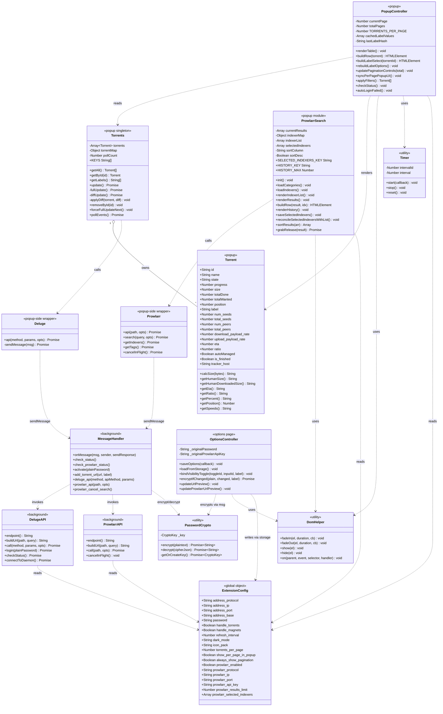

```mermaid
classDiagram
    %% ─── Background-side modules (in background.js) ───
    class ExtensionConfig {
        <<global object>>
        +String address_protocol
        +String address_ip
        +String address_port
        +String address_base
        +String password
        +Boolean handle_torrents
        +Boolean handle_magnets
        +Number refresh_interval
        +String dark_mode
        +String icon_pack
        +Number torrents_per_page
        +Boolean show_per_page_in_popup
        +Boolean always_show_pagination
        +Boolean prowlarr_enabled
        +String prowlarr_protocol
        +String prowlarr_ip
        +String prowlarr_port
        +String prowlarr_api_key
        +Number prowlarr_results_limit
        +Array prowlarr_selected_indexers
    }

    class DelugeAPI {
        <<background>>
        +endpoint() String
        +buildUrl(path, query) String
        +call(method, params, opts) Promise
        +login(plainPassword) Promise
        +checkStatus() Promise
        +connectToDaemon() Promise
    }

    class ProwlarrAPI {
        <<background>>
        +endpoint() String
        +buildUrl(path, query) String
        +call(path, opts) Promise
        +cancelInFlight() void
    }

    class PasswordCrypto {
        <<utility>>
        -CryptoKey _key
        +encrypt(plaintext) Promise~String~
        +decrypt(cipherJson) Promise~String~
        -getOrCreateKey() Promise~CryptoKey~
    }

    class MessageHandler {
        <<background>>
        +onMessage(msg, sender, sendResponse)
        +check_status()
        +check_prowlarr_status()
        +activate(plainPassword)
        +add_torrent_url(url, label)
        +deluge_api(method, apiMethod, params)
        +prowlarr_api(path, opts)
        +prowlarr_cancel_search()
    }

    %% ─── Popup-side modules ───
    class Torrent {
        <<popup>>
        +String id
        +String name
        +String state
        +Number progress
        +Number size
        +Number totalDone
        +Number totalWanted
        +Number position
        +String label
        +Number num_seeds
        +Number total_seeds
        +Number num_peers
        +Number total_peers
        +Number download_payload_rate
        +Number upload_payload_rate
        +Number eta
        +Number ratio
        +Boolean autoManaged
        +Boolean is_finished
        +String tracker_host
        +calcSize(bytes) String
        +getHumanSize() String
        +getHumanDownloadedSize() String
        +getEta() String
        +getRatio() String
        +getPercent() String
        +getPosition() Number
        +getSpeeds() String
    }

    class Torrents {
        <<popup singleton>>
        -Array~Torrent~ torrents
        -Object torrentMap
        -Number pollCount
        +KEYS String[]
        +getAll() Torrent[]
        +getById(id) Torrent
        +getLabels() String[]
        +update() Promise
        -fullUpdate() Promise
        -diffUpdate() Promise
        -applyDiff(torrent, diff) void
        +removeById(id) void
        +forceFullUpdateNext() void
        +pollEvents() Promise
    }

    class PopupController {
        <<popup>>
        -Number currentPage
        -Number totalPages
        -Number TORRENTS_PER_PAGE
        -Array cachedLabelValues
        -String lastLabelHash
        +renderTable() void
        +buildRow(torrent) HTMLElement
        +buildLabelSelect(torrentId) HTMLElement
        +rebuildLabelOptions() void
        +updatePaginationControls(total) void
        +syncPerPagePopupUI() void
        +applyFilters() Torrent[]
        +checkStatus() void
        +autoLoginFailed() void
    }

    class ProwlarrSearch {
        <<popup module>>
        -Array currentResults
        -Object indexerMap
        -Array indexerList
        -Array selectedIndexers
        -String sortColumn
        -Boolean sortDesc
        +SELECTED_INDEXERS_KEY String
        +HISTORY_KEY String
        +HISTORY_MAX Number
        +init() void
        +loadCategories() void
        +loadIndexers() void
        +renderIndexerList() void
        +renderResults() void
        +buildRow(result, idx) HTMLElement
        +renderHistory() void
        +saveSelectedIndexers() void
        +reconcileSelectedIndexersWithList() void
        +sortResults(arr) Array
        +grabRelease(result) Promise
    }

    class Deluge {
        <<popup-side wrapper>>
        +api(method, params, opts) Promise
        -sendMessage(msg) Promise
    }

    class Prowlarr {
        <<popup-side wrapper>>
        +api(path, opts) Promise
        +search(query, opts) Promise
        +getIndexers() Promise
        +getTags() Promise
        +cancelInFlight() Promise
    }

    class DomHelper {
        <<utility>>
        +fadeIn(el, duration, cb) void
        +fadeOut(el, duration, cb) void
        +show(el) void
        +hide(el) void
        +on(parent, event, selector, handler) void
    }

    class Timer {
        <<utility>>
        -Number intervalId
        -Number interval
        +start(callback) void
        +stop() void
        +reset() void
    }

    %% ─── Options-side ───
    class OptionsController {
        <<options page>>
        -String _originalPassword
        -String _originalProwlarrApiKey
        +saveOptions(callback) void
        +loadFromStorage() void
        +bindVisibilityToggle(toggleId, inputId, label) void
        +encryptIfChanged(plain, changed, label) Promise
        +updateUrlPreview() void
        +updateProwlarrUrlPreview() void
    }

    %% ─── Relationships ───
    Torrents "1" o-- "*" Torrent : owns
    Torrents ..> Deluge : calls
    PopupController ..> Torrents : reads
    PopupController ..> Torrent : renders
    PopupController ..> DomHelper : uses
    PopupController ..> Timer : uses
    ProwlarrSearch ..> Prowlarr : calls
    ProwlarrSearch ..> DomHelper : uses
    OptionsController ..> PasswordCrypto : encrypts via msg
    OptionsController ..> DomHelper : uses

    Deluge ..> MessageHandler : sendMessage
    Prowlarr ..> MessageHandler : sendMessage

    MessageHandler ..> DelugeAPI : invokes
    MessageHandler ..> ProwlarrAPI : invokes
    MessageHandler ..> PasswordCrypto : encrypt/decrypt

    DelugeAPI ..> ExtensionConfig : reads
    ProwlarrAPI ..> ExtensionConfig : reads
    OptionsController ..> ExtensionConfig : writes via storage
    PopupController ..> ExtensionConfig : reads
    ProwlarrSearch ..> ExtensionConfig : reads
```
