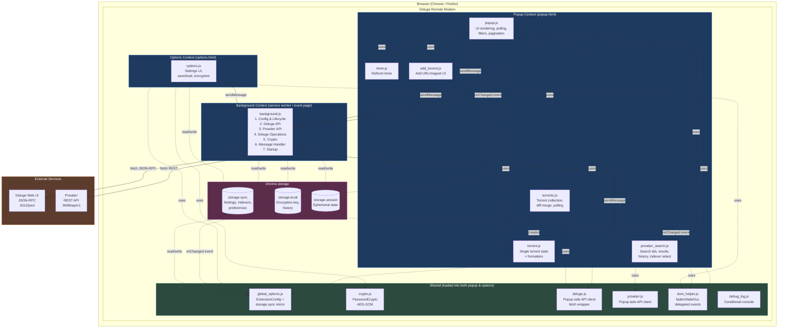

```mermaid
graph TB
    subgraph Browser["Browser (Chrome / Firefox)"]
        subgraph Extension["Deluge Remote Modern"]
            subgraph PopupCtx["Popup Context (popup.html)"]
                Popup[popup.js<br/>UI rendering, polling,<br/>filters, pagination]
                ProwlarrSearch[prowlarr_search.js<br/>Search tab, results,<br/>history, indexer select]
                Torrents[torrents.js<br/>Torrent collection,<br/>diff merge, polling]
                Torrent[torrent.js<br/>Single torrent state<br/>+ formatters]
                Timer[timer.js<br/>Refresh timer]
                AddTorrent[add_torrent.js<br/>Add URL/magnet UI]
            end

            subgraph OptionsCtx["Options Context (options.html)"]
                Options[options.js<br/>Settings UI,<br/>save/load, encryption]
            end

            subgraph BgCtx["Background Context (service worker / event page)"]
                Background[background.js<br/>1. Config & Lifecycle<br/>2. Deluge API<br/>3. Prowlarr API<br/>4. Deluge Operations<br/>5. Crypto<br/>6. Message Handler<br/>7. Startup]
            end

            subgraph Shared["Shared (loaded into both popup & options)"]
                GlobalOpts[global_options.js<br/>ExtensionConfig +<br/>storage.sync mirror]
                Crypto[crypto.js<br/>PasswordCrypto<br/>AES-GCM]
                Deluge[deluge.js<br/>Popup-side API client<br/>fetch wrapper]
                Prowlarr[prowlarr.js<br/>Popup-side API client]
                DOMHelper[dom_helper.js<br/>fadeIn/fadeOut,<br/>delegated events]
                DebugLog[debug_log.js<br/>Conditional console]
            end

            subgraph Storage["chrome.storage"]
                Sync[(storage.sync<br/>Settings, indexers,<br/>preferences)]
                Local[(storage.local<br/>Encryption key,<br/>history)]
                Session[(storage.session<br/>Ephemeral state)]
            end
        end
    end

    subgraph External["External Services"]
        DelugeServer[Deluge Web UI<br/>JSON-RPC<br/>:8112/json]
        ProwlarrServer[Prowlarr<br/>REST API<br/>:9696/api/v1]
    end

    Popup -.uses.-> Torrents
    Popup -.uses.-> Timer
    Popup -.uses.-> AddTorrent
    Popup -.uses.-> ProwlarrSearch
    Popup -.uses.-> Deluge
    Popup -.uses.-> DOMHelper
    Popup -.uses.-> GlobalOpts
    Torrents -.creates.-> Torrent
    Torrents -.uses.-> Deluge
    ProwlarrSearch -.uses.-> Prowlarr
    ProwlarrSearch -.uses.-> DOMHelper
    Options -.uses.-> Crypto
    Options -.uses.-> GlobalOpts
    Options -.uses.-> DOMHelper

    Popup -->|sendMessage| Background
    Options -->|sendMessage| Background
    ProwlarrSearch -->|sendMessage| Background
    AddTorrent -->|sendMessage| Background

    Background -->|fetch JSON-RPC| DelugeServer
    Background -->|fetch REST| ProwlarrServer

    Background <-.->|read/write| Sync
    Background <-.->|read/write| Local
    Background <-.->|read/write| Session
    GlobalOpts <-.->|read/write| Sync
    Options <-.->|read/write| Sync

    Sync -.onChanged event.-> GlobalOpts
    Sync -.onChanged event.-> Popup
    Sync -.onChanged event.-> ProwlarrSearch

    classDef context fill:#1e3a5f,stroke:#4a90e2,color:#fff
    classDef shared fill:#2d4a3e,stroke:#52b788,color:#fff
    classDef storage fill:#5c2d4a,stroke:#c77dff,color:#fff
    classDef external fill:#5c3d2d,stroke:#e29c52,color:#fff
    class PopupCtx,OptionsCtx,BgCtx context
    class Shared shared
    class Storage storage
    class External external
```
