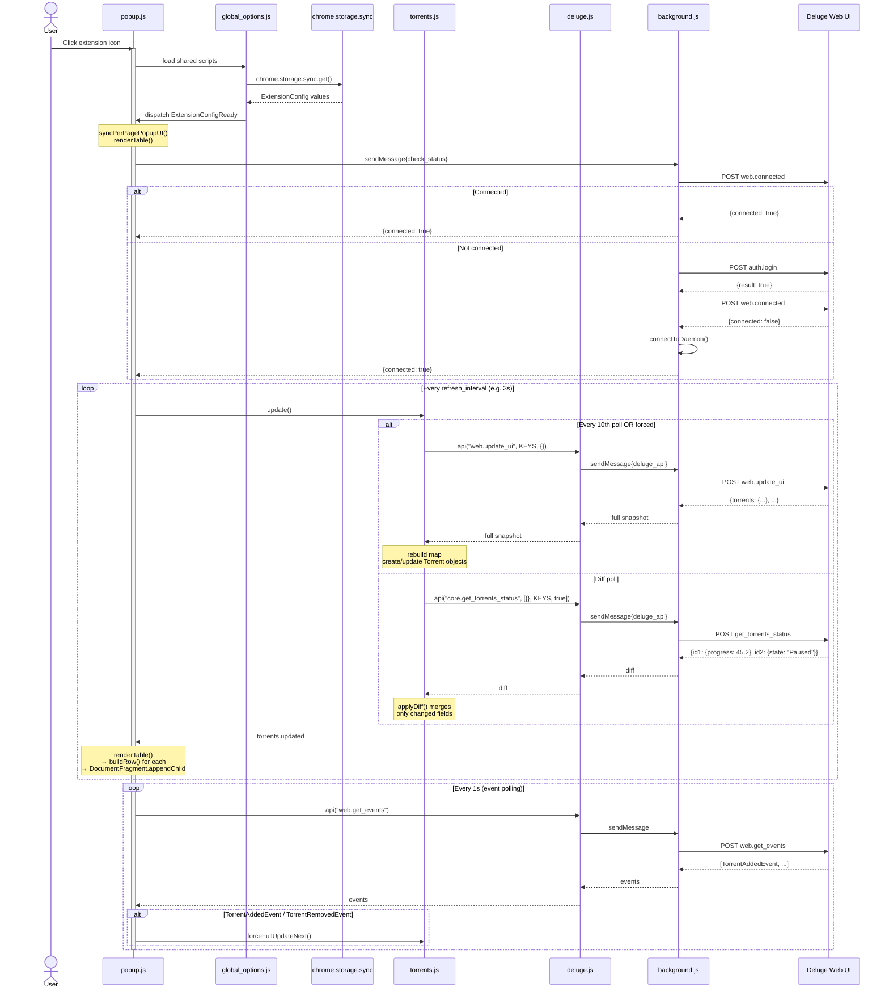
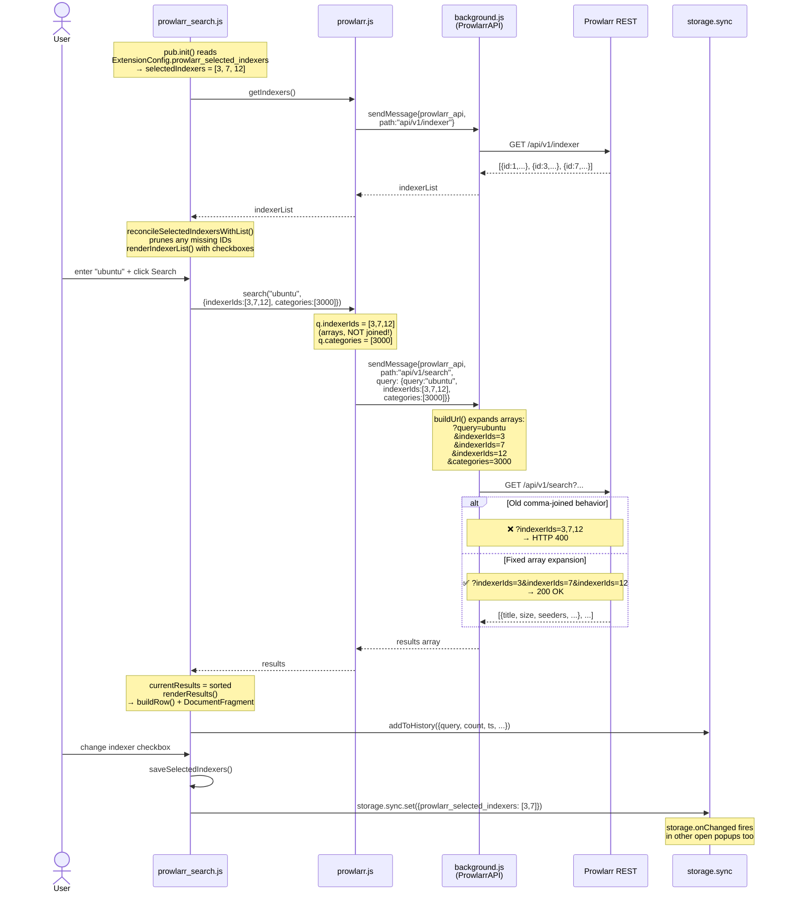
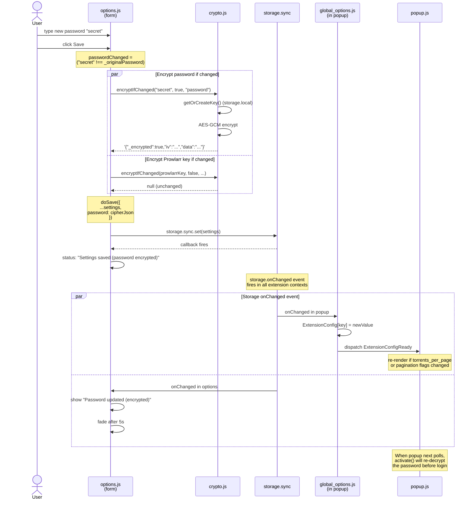
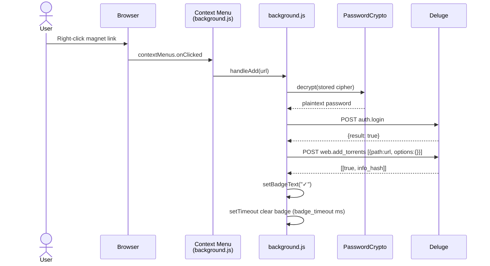

# Deluge Remote Modern — Sequence Diagrams

Three key runtime flows.

---

## Flow 1 — Popup open + torrent polling cycle

---

## Flow 2 — Prowlarr search (with multi-indexer fix)

---

## Flow 3 — Save options (with encrypted password)

---

## Flow 4 — Add torrent (right-click "Send to Deluge")

